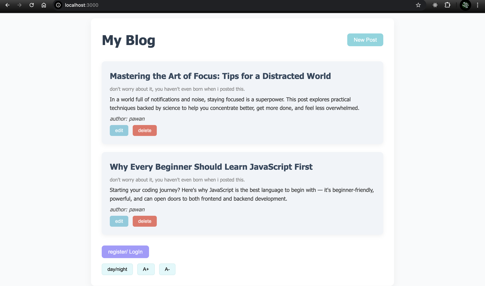
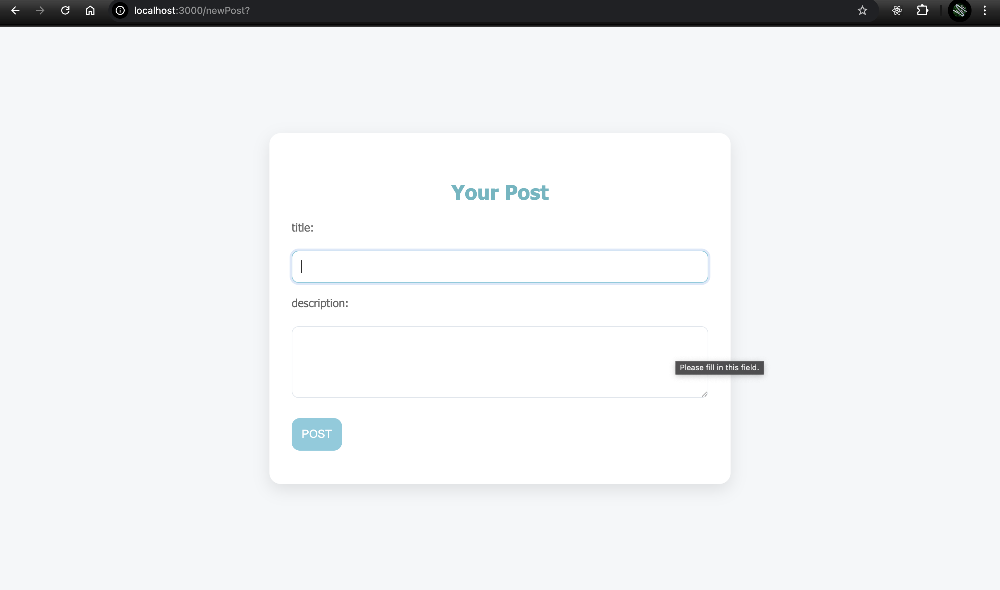
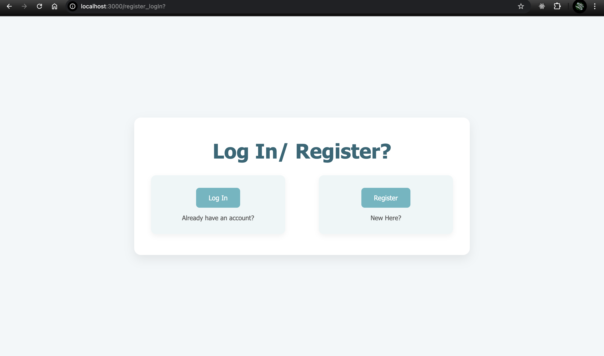
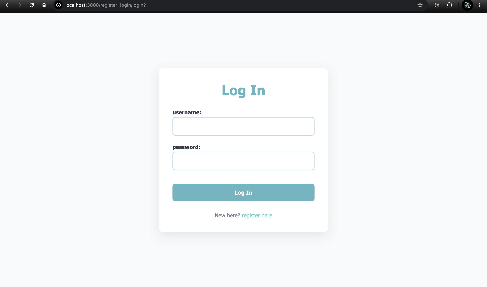
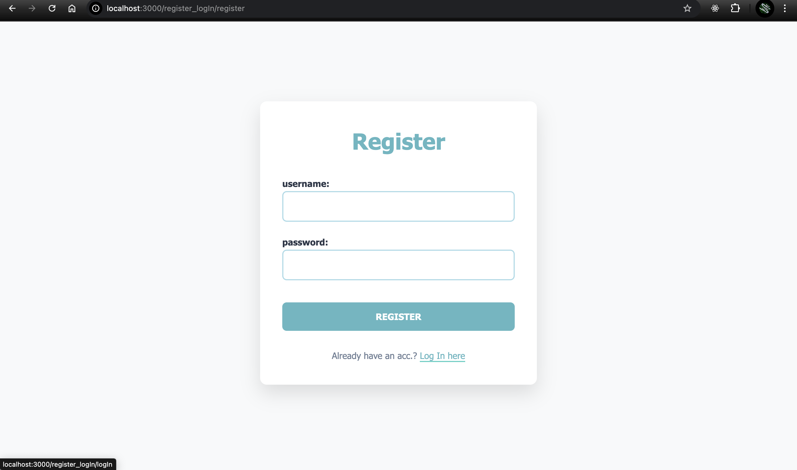
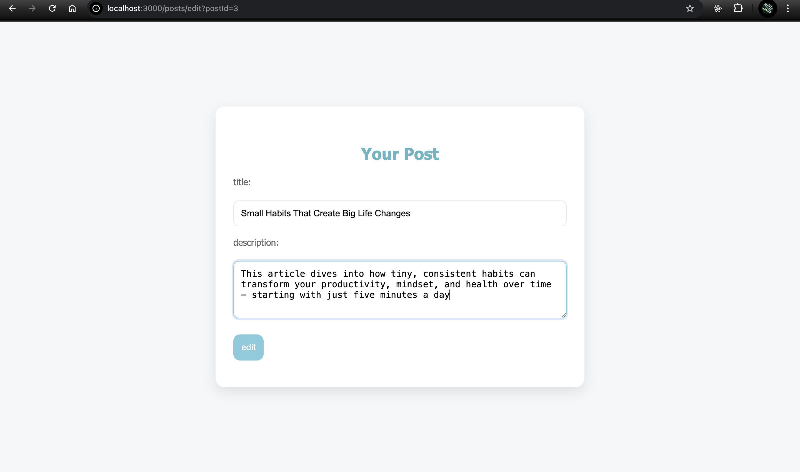
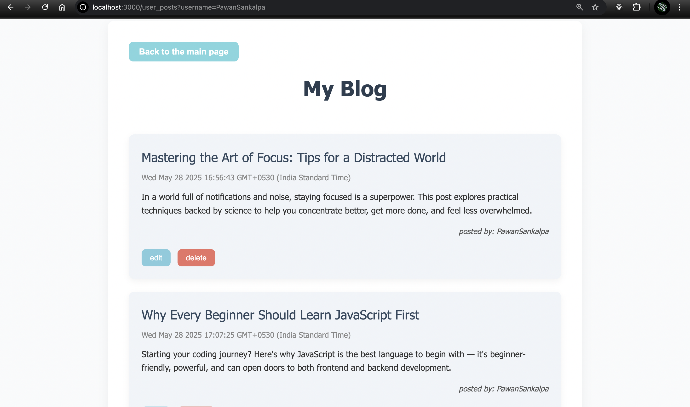

# Blog Website - Express.js with EJS 

This is the **frontend** part of a blog website built using Express.js and EJS templating. It interacts with a separate backend server through API requests to display and manage blog posts.

---

## 🚀 Features

- Display all blog posts on the homepage
- Create a new blog post
- Edit or delete existing posts
- Register and login pages (UI only)
- Responsive EJS templates

---

## 🛠 Technologies Used

- Node.js
- Express.js
- EJS
- Axios
- Body-parser

---

## API Knowledge Demonstrated in This Project

- Implemented a RESTful API using Express.js for the backend, with Axios on the frontend to make asynchronous HTTP requests.

- One of the main challenges in this project was designing and creating the API endpoints. Handling different HTTP methods such as GET, POST, PATCH, and DELETE required careful thought to ensure data was processed correctly, errors were managed properly, and appropriate status codes were returned.

- Developed full CRUD functionality for blog posts using REST principles.

- Ensured frontend-backend communication works smoothly by dynamically rendering API data with EJS templates.

- Implemented error handling, request validation, and used meaningful status codes to indicate the outcome of operations.


## 📦 Installation

1. **Clone the repository:**
```bash
git clone https://github.com/yourusername/blog-frontend.git
cd blog-frontend
```
2. **Install dependencies:**
```bash
npm install
```
3. **Start the server:**
```bash
node index.js 
```
*Open a new terminal, then cd to the project folder and run:*
``` bash
node dataHandling.js
```
4. **Visit in browser:**
```
http://localhost:3000
```

## 🔗 Backend Server
This frontend expects a backend API to be running at:
```
http://localhost:4000
```

**Make sure to start the backend server as well. The API endpoints it uses include:**

- GET /posts – Get all posts

- POST /posts – Create a new post

- PUT /posts/:id – Update a post

- DELETE /posts/:id – Delete a post

### ✏️ Author
**Crafted with passion by Pawan Sankalpa**

## Screenshots

----

---

---

---

---

---



